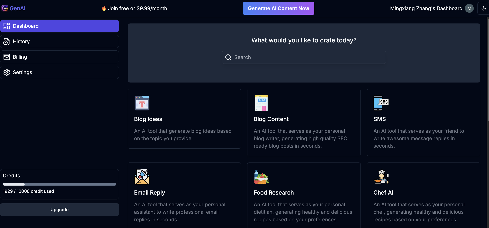
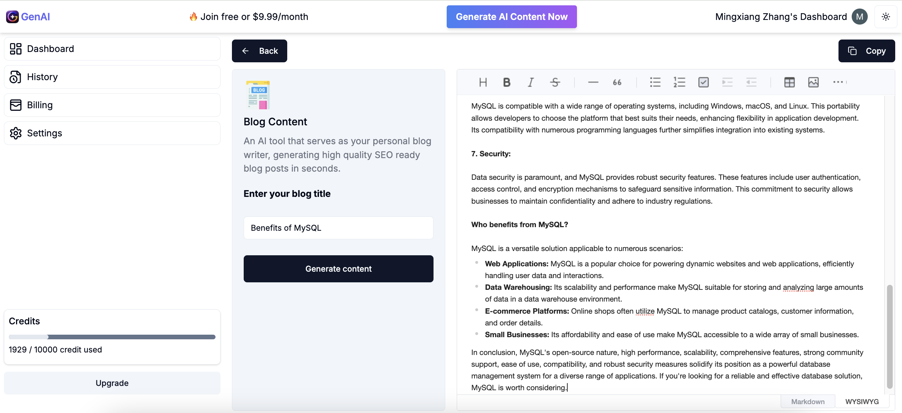
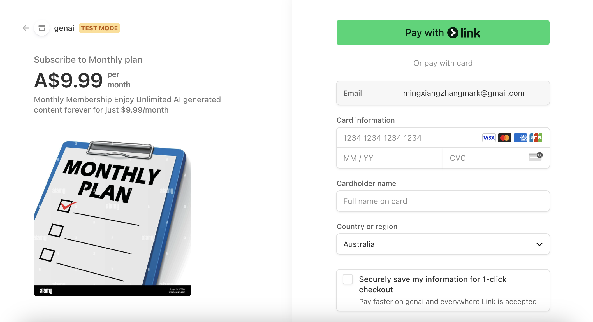
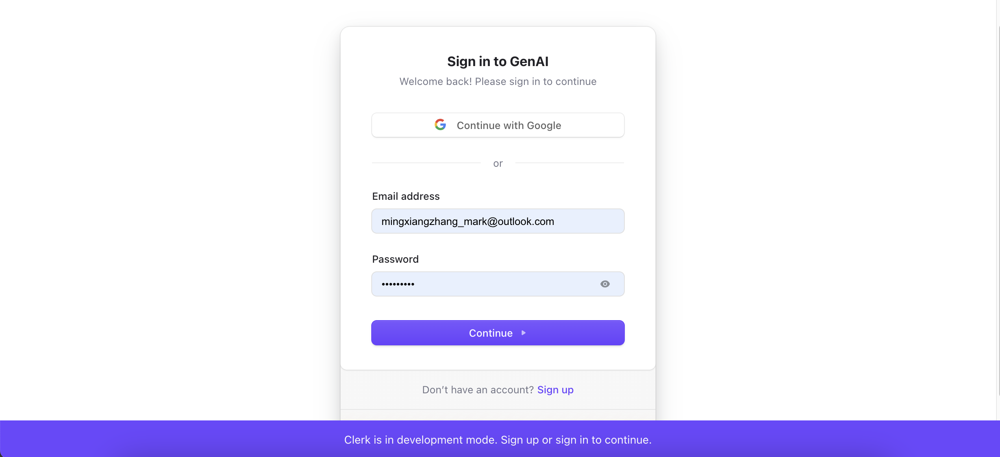

# GEN-AI: Your AI-Powered Content Creation Platform

GEN-AI is a user-friendly platform designed to leverage the power of AI to generate customized content based on user input. Whether you need blog posts, email replies, code snippets, or other forms of text, GEN-AI offers a seamless and intuitive experience to meet your content needs.

## Live Demo
[GEN-AI Live Demo](https://genai-livid.vercel.app/)

https://genai-livid.vercel.app/

## Features

### AI-Generated Custom Content
- Generate personalized content in seconds by providing a simple description or prompt.
- Supports diverse use cases such as blog writing, professional email replies, creative storytelling, and even code generation.

### User Authentication
- Secure login and registration system for personalized access.
- Manage your account effortlessly with a modern and intuitive interface.

### History Management
- Keep track of all your previous AI-generated content.
- Easily edit, review, and reuse past content directly from your history.

### Content Editing
- Built-in editor to refine and customize AI-generated content.
- Save and manage your edits for future use.

### Subscription Plans and Payments
- Upgrade to premium plans for advanced features like unlimited content generation.
- Seamlessly integrated payment system for a smooth transaction experience.

### Responsive Design
- Fully responsive layout for desktops, tablets, and smartphones.
- Optimized for usability on any device with a clean, modern UI.

## Why Choose GEN-AI?
GEN-AI simplifies the content creation process by combining powerful AI capabilities with an accessible and user-friendly design. Perfect for writers, developers, and anyone looking to save time while maintaining high-quality output.

## Technology Stack
- **Frontend:** React, Tailwind CSS, Next.js
- **Backend:** Node.js, Express, MongoDB
- **Authentication:** Clerk
- **Payment Gateway:** Stripe
- **AI Integration:** Google Generative AI (Gemini Model)

## How to Get Started
1. Sign up or log in to your GEN-AI account.
2. Provide a brief description of your desired content.
3. Edit and customize the generated content as needed.
4. Save, share, or reuse your AI-powered creations.

Explore the power of AI-driven content creation with GEN-AI. It's fast, efficient, and tailored to your unique needs.


## Project Preview









This is a [Next.js](https://nextjs.org) project bootstrapped with [`create-next-app`](https://nextjs.org/docs/app/api-reference/cli/create-next-app).

## Getting Started

First, run the development server:

```bash
npm run dev
# or
yarn dev
# or
pnpm dev
# or
bun dev
```

Open [http://localhost:3000](http://localhost:3000) with your browser to see the result.

You can start editing the page by modifying `app/page.tsx`. The page auto-updates as you edit the file.

This project uses [`next/font`](https://nextjs.org/docs/app/building-your-application/optimizing/fonts) to automatically optimize and load [Geist](https://vercel.com/font), a new font family for Vercel.

## Learn More

To learn more about Next.js, take a look at the following resources:

- [Next.js Documentation](https://nextjs.org/docs) - learn about Next.js features and API.
- [Learn Next.js](https://nextjs.org/learn) - an interactive Next.js tutorial.

You can check out [the Next.js GitHub repository](https://github.com/vercel/next.js) - your feedback and contributions are welcome!

## Deploy on Vercel

The easiest way to deploy your Next.js app is to use the [Vercel Platform](https://vercel.com/new?utm_medium=default-template&filter=next.js&utm_source=create-next-app&utm_campaign=create-next-app-readme) from the creators of Next.js.

Check out our [Next.js deployment documentation](https://nextjs.org/docs/app/building-your-application/deploying) for more details.
